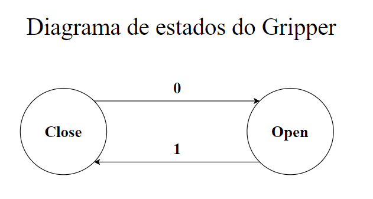

# Gripper

No desenvolvimento dos códigos, foi utilizado o gripper **modelo** como ferramenta. Por se tratar de uma garra, sua função consiste em pegar e soltar, sendo utilizado em aplicações _pick and place_.

# Funcionamento

O gripper funciona com base na lógica digital **SET-RESET**, isto é, ele abre e fecha com comando de 'set'.

Na configuração padrão, os bits representam as seguintes saídas:

**0 -> abre a garra**

**1 -> fecha a garra**

É importante destacar que não basta apenas setar um bit para que a garra funcione. Antes de setar, é necessário resetar o bit não desejado, ou seja, se se deseja setar 0, antes se reseta o 1.

A figura abaixo ilustra o funcionamento do gripper:

